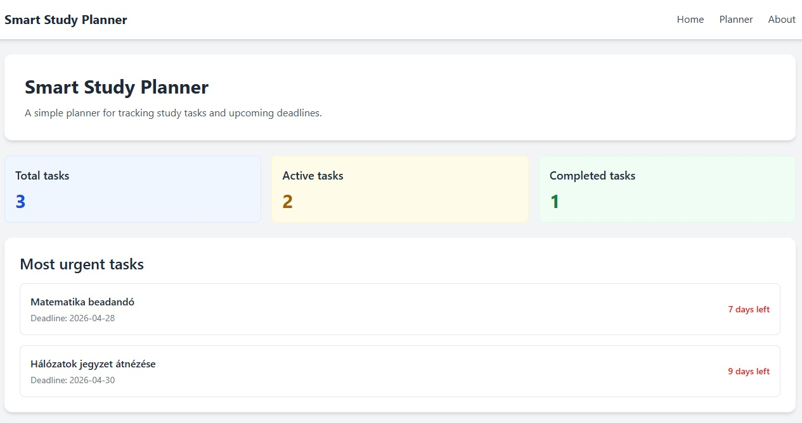
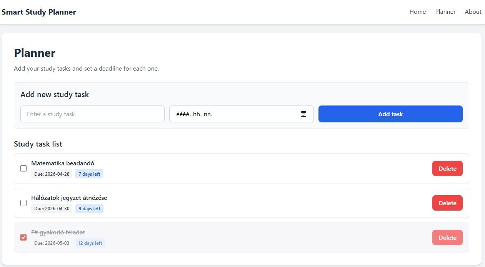

# Smart Study Planner

A simple web-based study planner application built with F# and WebSharper.

## 📂 Repository
👉 https://github.com/reaimx/smart-study-planner-alpha

# Live demo:
https://reaimx.github.io/smart-study-planner-alpha/#/

## 📌 Description

Smart Study Planner is a single-page web application that helps users manage their study tasks and track deadlines.  
Users can add tasks, assign deadlines, mark them as completed, and view the most urgent tasks.

## 🚀 Features

- Add study tasks
- Set deadlines for tasks
- Mark tasks as completed
- Delete tasks
- Automatic sorting by deadline
- "Most urgent tasks" overview on the Home page
- Summary statistics (total, active, completed tasks)

## 🛠 Technologies

- F#
- WebSharper
- ASP.NET Core
- Tailwind CSS

## 📸 Screenshots

### Home page

### Planner page

